# Hi, I'm Drew ✨

<!-- README-META
  tlp_clearance: GREEN
  status: active
  name: dcyfr
  last_validated: 2026-04-12
-->

> Cyber Architect, Security Practitioner, and Agentic Builder

I'm Drew (dcyfr), a cyber architect and builder focused on designing secure, innovative solutions for the modern web. With a passion for system architecture, threat modeling, and AI agents, I create tools and frameworks that empower developers to build with security and scalability in mind.

**[DCYFR™](https://www.dcyfr.ai)** — Secure, innovative solutions for the modern web. Cyber architecture and design.

---

## 🏗️ How It Fits Together

```mermaid
graph TD
    AI["@dcyfr/ai · Core Framework"]
    CLI["@dcyfr/ai-cli · CLI"]
    RAG["@dcyfr/ai-rag · RAG"]
    CODEGEN["@dcyfr/ai-code-gen · Code Gen"]

    AI --> CLI
    AI --> RAG
    AI --> CODEGEN

    subgraph Plugins
        OFFICIAL["dcyfr-plugins · Official"]
        COMMUNITY["dcyfr-community-plugins"]
    end
    AI --> OFFICIAL
    AI --> COMMUNITY

    subgraph Templates
        AGENTS["dcyfr-ai-agents"]
        API["dcyfr-ai-api"]
        GRAPHQL["dcyfr-ai-graphql"]
        REACT["dcyfr-ai-react"]
        CHATBOT["dcyfr-ai-chatbot"]
        NODEJS["dcyfr-ai-nodejs"]
    end
    AI -.->|starter templates| AGENTS
    AI -.-> API
    AI -.-> GRAPHQL
    AI -.-> REACT
    AI -.-> CHATBOT
    AI -.-> NODEJS

    LABS["dcyfr-labs · dcyfr.ai"]
    AI --> LABS
    SANDBOX["dcyfr-ai-sandbox"]
    AI -.-> SANDBOX

    style AI fill:#4A90D9,color:#fff
    style OFFICIAL fill:#2ECC71,color:#fff
    style LABS fill:#E67E22,color:#fff
```

---

## 📦 Core Framework

Published on [npm](https://www.npmjs.com/org/dcyfr) — install with npm/yarn/pnpm:

| Package | Version | Description | Install |
|---------|---------|-------------|---------|
| [`@dcyfr/ai`](https://github.com/dcyfr/dcyfr-ai) |  | Portable AI agent harness with plugin architecture | `npm i @dcyfr/ai` |
| [`@dcyfr/ai-cli`](https://github.com/dcyfr/dcyfr-ai-cli) |  | Cross-platform CLI for the DCYFR framework | `npm i -g @dcyfr/ai-cli` |
| [`@dcyfr/ai-rag`](https://github.com/dcyfr/dcyfr-ai-rag) |  | RAG framework — loaders, embeddings, vector stores | `npm i @dcyfr/ai-rag` |
| [`@dcyfr/ai-code-gen`](https://github.com/dcyfr/dcyfr-ai-code-gen) |  | AI-powered code generation with AST manipulation | `npm i @dcyfr/ai-code-gen` |

---

## 🚀 Starter Templates

Clone directly or use GitHub's **"Use this template"** button:

| I want to... | Template | Stack | Version |
|--------------|----------|-------|---------|
| **Build autonomous agents** | [dcyfr-ai-agents](https://github.com/dcyfr/dcyfr-ai-agents) | Node 20+, TypeScript, tool use, memory | v1.0.0 |
| **Build a REST API** | [dcyfr-ai-api](https://github.com/dcyfr/dcyfr-ai-api) | Express 5, Drizzle ORM, JWT, OpenAPI | v2.0.0 |
| **Build a GraphQL API** | [dcyfr-ai-graphql](https://github.com/dcyfr/dcyfr-ai-graphql) | Apollo Server 4, schema-first, type-safe | v1.0.0 |
| **Build a React SPA** | [dcyfr-ai-react](https://github.com/dcyfr/dcyfr-ai-react) | React 19, Vite, TanStack, Zustand, Shadcn/ui | v1.0.0 |
| **Build a chatbot** | [dcyfr-ai-chatbot](https://github.com/dcyfr/dcyfr-ai-chatbot) | Multi-turn conversations, streaming | v1.0.0 |
| **Node.js web server** | [dcyfr-ai-nodejs](https://github.com/dcyfr/dcyfr-ai-nodejs) | Node 24+, TypeScript strict, 80%+ coverage | v1.0.0 |

⚠️ Deprecated templates (still usable, no longer maintained)

| Template | Deprecated | Notes |
|----------|-----------|-------|
| [dcyfr-ai-web](https://github.com/dcyfr/dcyfr-ai-web) | Feb 2026 | Full-stack Next.js — deprecated on npm, still works as template |
| [dcyfr-ai-docker](https://github.com/dcyfr/dcyfr-ai-docker) | Feb 2026 | Docker containerization — template, not a library |
| [dcyfr-ai-kubernetes](https://github.com/dcyfr/dcyfr-ai-kubernetes) | Feb 2026 | Consolidated into agent knowledge; see Pulumi/CDK8s/Helm |
| [dcyfr-ai-notebooks](https://github.com/dcyfr/dcyfr-ai-notebooks) | Feb 2026 | No longer maintained; see Observable, Jupyter, Hex |

---

## 🔌 Plugin Ecosystem

Extend `@dcyfr/ai` with curated or community plugins:

| Registry | Scope | Security |
|----------|-------|----------|
| [dcyfr-plugins](https://github.com/dcyfr/dcyfr-plugins) | Official, curated | ✅ Security-scanned, trust-scored |
| [dcyfr-community-plugins](https://github.com/dcyfr/dcyfr-community-plugins) | Community | ⚠️ Auto-scanned, unaudited |

---

## ⭐ Reference Implementation

**[dcyfr-labs](https://github.com/dcyfr/dcyfr-labs)** — The live [dcyfr.ai](https://www.dcyfr.ai) site. Enterprise Next.js 16, React 19, Tailwind v4, MDX blog, Redis analytics, Inngest jobs. Study the architecture — for your own app, start from a [template](#-starter-templates) instead.

---

## 🌐 Web Properties

| Domain | Repo | Purpose | Status |
|--------|------|---------|--------|
| [dcyfr.ai](https://www.dcyfr.ai) | [dcyfr-labs](https://github.com/dcyfr/dcyfr-labs) | Blog, portfolio, reference architecture | 🟢 Live |
| dcyfr.io | [dcyfr-io](https://github.com/dcyfr/dcyfr-io) | Product ecosystem control center | 🔵 Planned |
| dcyfr.app | [dcyfr-app](https://github.com/dcyfr/dcyfr-app) | Interactive template showcase | 🔵 Planned |
| dcyfr.tech | [dcyfr-tech](https://github.com/dcyfr/dcyfr-tech) | Research hub & whitepapers | 🔵 Planned |
| dcyfr.codes | [dcyfr-codes](https://github.com/dcyfr/dcyfr-codes) | Searchable code patterns & recipes | 🔵 Planned |
| dcyfr.bot | [dcyfr-bot](https://github.com/dcyfr/dcyfr-bot) | Bot marketplace | 🔵 Planned |
| dcyfr.build | [dcyfr-build](https://github.com/dcyfr/dcyfr-build) | Build tools hub | 🔵 Planned |
| dcyfr.work | [dcyfr-work](https://github.com/dcyfr/dcyfr-work) | Work portal | 🔵 Planned |

---

## 🧪 Sandbox

[dcyfr-ai-sandbox](https://github.com/dcyfr/dcyfr-ai-sandbox) — Testing and benchmarking playground for the `@dcyfr/ai` framework.

---

## 💡 Tech Stack

## 📊 GitHub Stats

## 🔭 Current Focus

- Shipping the `@dcyfr/ai` plugin ecosystem and community marketplace
- Expanding starter templates with real-world patterns
- Building branded web properties (dcyfr.io, dcyfr.app, dcyfr.tech)
- Exploring agentic AI, RAG pipelines, and autonomous code generation
- Contributing to open-source security and developer tooling

## 🤝 Contributing

Contributions welcome! Each repo has its own contributing guide.

- **Bug reports** — Open an issue on the relevant repo
- **Feature requests** — Start a [discussion](https://github.com/dcyfr/dcyfr-ai/discussions) on dcyfr-ai
- **Security issues** — See the [Security Policy](#-security) below — do **not** open public issues for vulnerabilities

## 🔒 Security

All DCYFR packages follow responsible disclosure. Report vulnerabilities via [SECURITY.md](https://github.com/dcyfr/dcyfr-ai/blob/main/SECURITY.md) or email **security@dcyfr.ai**.

## 📬 Connect

